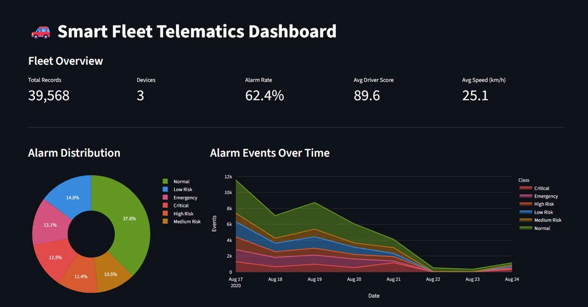

# 🚗 Smart Fleet Telematics Analytics

> An end-to-end data engineering and machine learning pipeline that ingests raw OBD-II telematics events, engineers features, predicts driver risk with 99.4% accuracy, and serves an interactive Streamlit dashboard.


---

## 📌 Project Overview

This project processes real-world vehicle telematics data collected from OBD-II devices fitted to a fleet of 3 vehicles over 8 days (Aug 17–24, 2020). The raw data arrives in a long format — one row per sensor reading — covering 52 unique OBD-II sensor variables including GPS position, engine RPM, throttle, acceleration, battery, fuel, and temperature readings.

The pipeline transforms this into a wide analytical dataset, computes fleet KPIs, trains a multi-class alarm risk classifier, and presents everything through an interactive dashboard.

---

## 📊 Dashboard Preview



---

## 📁 Project Structure

```
fleet-analytics/
│
├── data/
│   ├── raw/
│   │   └── telematics.csv              # Raw OBD-II sensor data (long format)
│   └── processed/
│       └── processed_telematics.csv    # Pivoted wide-format dataset (auto-generated)
│
├── scripts/
│   ├── preprocess.py                   # Clean → pivot → feature engineering
│   ├── kpi_calculations.py             # Fleet KPIs → JSON report
│   └── load_to_postgres.py             # Push processed data to PostgreSQL
│
├── models/
│   └── train_driver_risk_model.py      # Random Forest alarm classifier
│
├── app/
│   └── app.py                          # Streamlit interactive dashboard
│
├── sql/
│   └── schema.sql                      # PostgreSQL DDL (raw + processed tables)
│
├── notebooks/
│   └── EDA.ipynb                       # Exploratory data analysis notebook
│
├── reports/                            # Auto-generated by pipeline
│   ├── kpi_report.json
│   └── model_report.json
│
├── run_pipeline.py                     # One-command pipeline orchestrator
├── requirements.txt
└── README.md
```

---

## 🔢 Dataset

### Raw format (long)
One row per sensor reading per device.

| Column | Type | Description |
|--------|------|-------------|
| `deviceId` | string | Vehicle/device identifier |
| `timeMili` | float | Unix timestamp (ms) |
| `timestamp` | string | Human-readable datetime |
| `value` | string | Sensor value — plain float or `lat,lng,altitude` for POSITION rows |
| `variable` | string | OBD-II sensor type (52 unique variables) |
| `alarmClass` | int | Target label 0–5 |

### Key stats
| Metric | Value |
|--------|-------|
| Raw records | 173,853 |
| Devices | 3 |
| Sensor variables | 52 |
| Date range | Aug 17 – Aug 24, 2020 |
| Processed records | 39,568 |
| Processed columns | 63 |

### Alarm class labels
| Class | Label | Count | % |
|-------|-------|-------|---|
| 0 | Normal | 14,875 | 37.6% |
| 1 | Low Risk | 5,870 | 14.8% |
| 2 | Medium Risk | 4,165 | 10.5% |
| 3 | High Risk | 4,508 | 11.4% |
| 4 | Critical | 4,958 | 12.5% |
| 5 | Emergency | 5,192 | 13.1% |

---

## ⚙️ Pipeline

```
telematics.csv (raw)
       │
       ▼
 preprocess.py          Long → Wide pivot, GPS parsing, feature engineering
       │
       ▼
processed_telematics.csv
       │
       ├──▶ kpi_calculations.py     Fleet KPIs → reports/kpi_report.json
       │
       ├──▶ train_driver_risk_model.py    RF classifier → models/driver_risk_model.pkl
       │
       └──▶ app.py                  Streamlit dashboard
```

### Step 1 — Preprocessing (`scripts/preprocess.py`)
- Deduplicates and cleans raw long-format data
- Parses POSITION sensor values (`lat,lng,altitude`) into separate columns
- Pivots 52 sensor variables into a wide column-per-sensor format
- Engineers new features:
  - `driver_score` — composite safety score (0–100) from RPM, engine load, accelerations, alarm class
  - `is_idle` — binary flag when speed = 0
  - `aggressive_throttle` — binary flag when throttle > 80%
  - `hour`, `day_of_week`, `date` — temporal features

### Step 2 — KPI Calculations (`scripts/kpi_calculations.py`)
Computes and saves a structured `reports/kpi_report.json` covering:
- Fleet overview (records, devices, date range)
- Alarm distribution and rates
- Driver score statistics (fleet avg: **89.6**, min: 62.1, max: 100)
- Speed analytics (avg: **25.1 km/h**, max: 175 km/h, overspeed events: 23)
- Engine health (avg RPM: **1,158**, avg coolant temp: **84.7°C**, zero overheat events)
- Per-device breakdown

### Step 3 — ML Model (`models/train_driver_risk_model.py`)
Trains a **Random Forest Classifier** to predict `alarm_class` (6-class).

| Metric | Value |
|--------|-------|
| Accuracy | **99.42%** |
| F1 Score (weighted) | **0.9942** |
| CV F1 Mean (5-fold) | **0.9959 ± 0.0006** |
| Train / Test split | 31,654 / 7,914 |
| Features used | 58 |

**Top features by importance:**
| Feature | Importance |
|---------|-----------|
| driver_score | 47.9% |
| acceleration_z | 7.0% |
| acceleration_x | 6.2% |
| engine_rpm | 5.4% |
| acceleration_y | 4.6% |
| hour | 4.0% |
| external_battery | 3.9% |

Model pipeline: `SimpleImputer (median)` → `RandomForestClassifier`
- `class_weight="balanced"` handles class imbalance
- `n_estimators=200`, `max_depth=20`, `n_jobs=-1`

---

## 🚀 Quick Start

### Prerequisites
- Python 3.9+
- pip

### 1. Clone the repository
```bash
git clone https://github.com/yourusername/smart-fleet-telematics.git
cd smart-fleet-telematics
```

### 2. Create and activate a virtual environment
```bash
python -m venv venv

# Windows
venv\Scripts\activate

# Mac / Linux
source venv/bin/activate
```

### 3. Install dependencies
```bash
pip install -r requirements.txt
```

### 4. Add your data
Place `telematics.csv` in the `data/raw/` folder:
```
data/raw/telematics.csv
```

### 5. Run the full pipeline
```bash
python run_pipeline.py
```

This runs all three steps: preprocess → KPIs → model training. Takes approximately **3 minutes**.

```
STEP: PREPROCESS   → data/processed/processed_telematics.csv
STEP: KPIS         → reports/kpi_report.json
STEP: MODEL        → models/driver_risk_model.pkl
                      reports/model_report.json
```

**Optional flags:**
```bash
python run_pipeline.py --skip-model    # Preprocess + KPIs only
python run_pipeline.py --only-model    # Retrain model only
```

### 6. Launch the dashboard
```bash
streamlit run app/app.py
```

Opens at **http://localhost:8501**

---

## 📈 Dashboard Features

The Streamlit dashboard includes:

- **Sidebar filters** — filter by device, date range, and alarm class
- **KPI cards** — total records, devices, alarm rate, avg driver score, avg speed
- **Alarm distribution** — donut chart with percentage breakdown
- **Alarm timeline** — stacked area chart of daily events by class
- **Driver score by device** — horizontal bar chart colour-coded by score
- **Speed distribution** — histogram with 80 km/h overspeed reference line
- **Engine RPM** — box plot broken down by alarm class
- **Coolant temperature** — histogram with 100°C overheat reference line
- **GPS track map** — scatter map of vehicle routes coloured by alarm class
- **Per-device summary table** — records, alarm rate, driver score, critical events
- **Raw data explorer** — filterable view of the processed dataset

---

## 🗄️ PostgreSQL Setup (Optional)

For Power BI or SQL-based analytics:

```bash
# 1. Create tables
psql -U postgres -d fleetdb -f sql/schema.sql

# 2. Set credentials via environment variables
export DB_USER=postgres
export DB_PASSWORD=yourpassword
export DB_HOST=localhost
export DB_PORT=5432
export DB_NAME=fleetdb

# 3. Load data
python scripts/load_to_postgres.py
```

The schema creates two tables:
- `fleet_telematics` — wide-format processed data with all 63 columns
- `fleet_raw_events` — original long-format raw data

---

## 🛠️ Tech Stack

| Layer | Technology |
|-------|-----------|
| Language | Python 3.9+ |
| Data processing | Pandas 2.1, NumPy 1.26 |
| Machine learning | scikit-learn 1.4 |
| Dashboard | Streamlit 1.33, Plotly 5.21 |
| Visualisation | Matplotlib 3.8, Seaborn 0.13 |
| Database | PostgreSQL + SQLAlchemy 2.0 |
| Notebook | Jupyter |

---

## 📋 Key Results

| KPI | Value |
|-----|-------|
| Fleet alarm rate | 62.4% |
| Critical + Emergency rate | 25.7% |
| Avg driver score | 89.6 / 100 |
| Max recorded speed | 175 km/h |
| Overspeed events (>80 km/h) | 23 |
| Avg engine RPM | 1,158 |
| Avg coolant temperature | 84.7°C |
| Overheat events | 0 |
| Model accuracy | 99.42% |
| Model CV F1 score | 0.9959 |

---

## 🤝 Contributing

Pull requests are welcome. For major changes, please open an issue first to discuss what you would like to change.

---

## 📄 License

This project is licensed under the MIT License — see the [LICENSE](LICENSE) file for details.

---

## 👤 Author

Built as part of a Smart Fleet Telematics Analytics project covering the full data engineering and ML lifecycle: ingestion → preprocessing → feature engineering → model training → dashboard.
